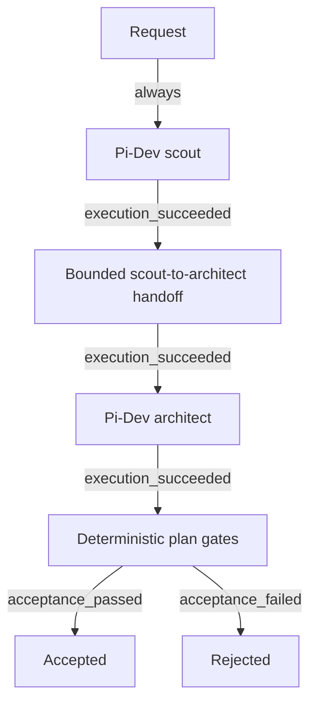

# Plan-change factory CLI

The SF-1 package exposes one production CLI over the shared application services:

```text
factory workflow show plan-change
factory workflow show plan-change --format mermaid
factory workflow show plan-change --format json
factory workflow validate plan-change
factory run plan-change --request "describe the change"
factory run plan-change --request requests/plan.txt
factory inspect <run-id>
factory abandon <run-id> [--json]
```

`--format json` is accepted only by `workflow show` and prints successful data only; failed JSON-format shows retain the complete application result and diagnostics. Add `--json` to any command for the full normalized application result and stable `exitCode`. Exit codes are `0` accepted/valid, `2` malformed arguments, `3` execution/provider/runtime failure, `4` rejected acceptance, and `5` unknown capability outcome. `workflow show` and `workflow validate` load the committed catalog and never require a provider. Human output escapes control, terminal, and bidi characters; JSON retains data. Mermaid is generated from the same normalized graph and digest.

`--request` is literal text unless it names an existing regular, non-symlink file inside the current git repository. Such files are read as bounded UTF-8 input (maximum 65,536 bytes). Directories, symlinks, special files, outside paths, invalid UTF-8, and oversized files are rejected. Run IDs are generated with cryptographic UUIDs.

Runs use the exact ignored state path `.pi/factory/runtime/<run-id>/` containing bounded `run.json`, `journal.jsonl`, and (when accepted for inspection) `artifacts/plan.json`. Runtime state is not product policy and is not committed. The runtime compares a complete no-follow repository manifest, including `.git`, and rejects repository mutation; only the exact canonical `.pi/factory/runtime` subtree is excluded. Git lock/index changes therefore count as mutations; controlled tests keep Git metadata stable. It does not write outside the ignored runtime root. Snapshot traversal uses an async directory iterator, a 16,384-entry ceiling, a 128 MiB cumulative file ceiling, bounded symlink targets, and a roughly 16 MiB encoded manifest ceiling while hashing incrementally. Request files require `O_NOFOLLOW`, canonical containment, regular-file and device/inode identity checks before and after a bounded max+1 incremental read, and fatal UTF-8 decoding.

## Graph



The graph is fixed at `plan-change@1`. Executor admission requires the exact seven phases, two capability targets, package-owned handoff adapter, four guards, and six guarded transitions; altered graphs are rejected before runtime state or dispatch. It executes exactly scout -> bounded handoff -> architect -> gates, with separate execution and acceptance outcomes. Capability receipts remain Protocol-owned; the workflow stores bounded receipt projections and never retries an unknown outcome. `abandon` is the only operator recovery action exposed by the CLI, uses a fixed operator identity, and preserves outcome uncertainty; resume/replay are not exposed.

## Standalone provider host

The standalone bin ships a generated JavaScript provider host and never enables a fake provider. The build verifies pinned Protocol v4.0.0 and Pi-Dev provenance, bundles the Protocol runtime with esbuild, and embeds the exact Pi-Dev contract digest and registration metadata. The real Pi coding SDK is pinned project-locally at 0.84.1 and uses the operator's agent directory for auth and model catalogs. TypeScript Pi extensions are normal because Pi loads extensions through jiti; upstream issue #5 is an optional plain-Node export enhancement, not a Factory blocker. The previous standalone limitation is no longer applicable; see [Kybernetria/pi-protocol#5](https://github.com/Kybernetria/pi-protocol/issues/5). An embedding host can inject a contract-faithful `CapabilityPort` into `FactoryApplication`/`createPlanChangeRuntime`; no fake mode is exposed through the CLI or environment.

The focused regression suite contains 51 deterministic tests covering hostile Git/request inputs, catalog leaf identity, topology admission, bounded snapshots, lock/recovery, unknown outcomes, abandon, runtime-record compatibility, projected prompt resolution, candidate path hygiene, and truthful provider startup diagnostics. Repository identity is schemaVersion 1 with only `head` and `filesDigest`; stale pre-merge records containing removed fields are rejected, so clear disposable runtime state after updating a branch. Nested sessions use in-memory session managers/settings and an explicit resource loader with ambient extensions, skills, prompt templates, themes, context files, project settings, and package resources disabled. Scout and architect run sequentially through canonical Protocol receipts with target-specific grants, cancellation, idempotent disposal, and bounded five-minute per-phase deadlines (ten minutes sequentially, plus bounded grace). The Protocol/worker boundary is trusted same-user code and is not a sandbox; ambient Pi resources are disabled but normal operator Pi tools and credentials remain available for model resolution. This slice defers SF-2 and does not add a TUI, retries, recovery engine, provider discovery, or operator-state integration. The remaining catalog/request-file race is same-user concurrent replacement of an ancestor after canonical checks; an approved native `openat2`/`openat` helper becomes an architecture decision only if deployments require protection from that attacker or a reproducible incident demonstrates the gap. Reconsider the deferred target-state workflow/package extraction only after a second independent consumer, measured duplication, or a release requirement establishes the trigger described in `docs/adr/0001-product-authority-and-reference-boundary.md`.
